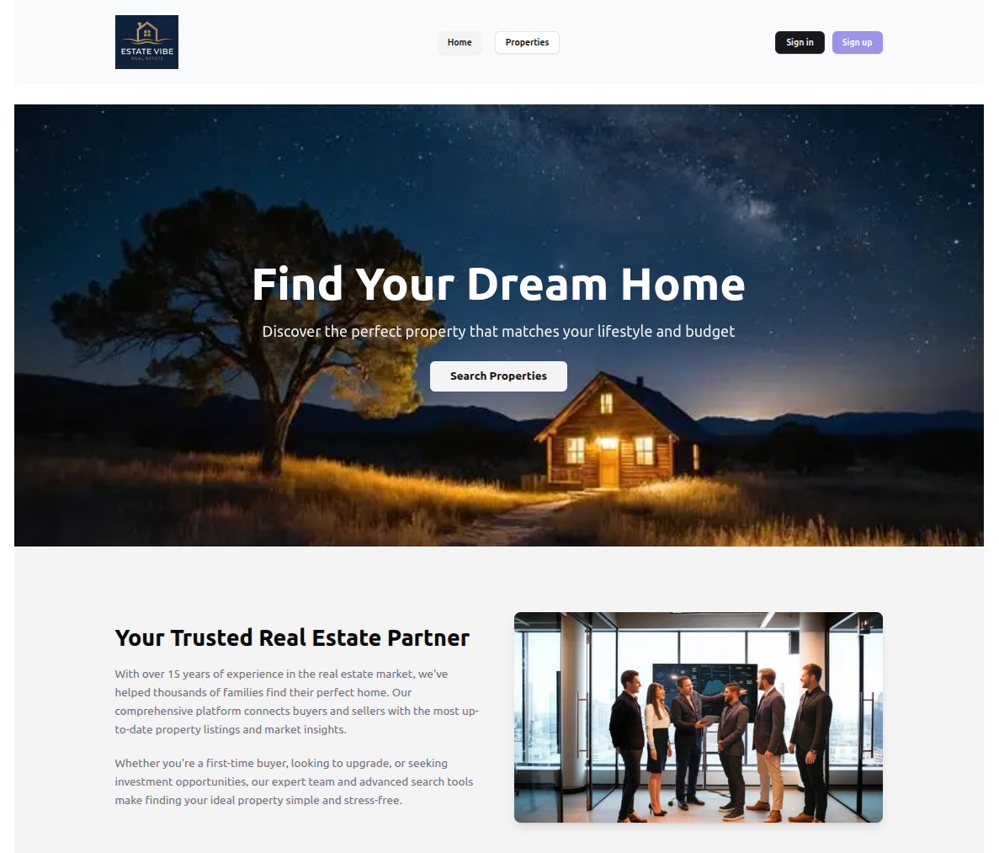
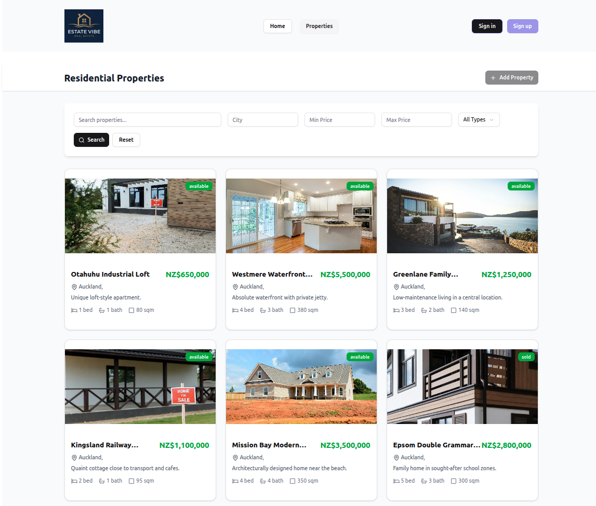

# Real Estate Clone - A Next.js Learning Project

This is a learning project built with Next.js to explore different Server-Side Rendering (SSR) strategies and techniques for working with backend data. The application is a simplified clone of a real estate website, which serves as a practical use case for these concepts.

The primary backend data source for this project is a PostgreSQL database hosted on Neon.

## Project Goals

*   Explore various SSR strategies in Next.js.
*   Practice fetching and displaying data from a real backend (Neon DB).
*   Understand the trade-offs between different rendering patterns like SSR, SSG, and ISR.

## Tech Stack
* Next.JS
* PostgreSQL (Neon)
* Prisma (ORM)
* Vercel (hosting)
* Clerk (Auth)
* Shadcn (UI components)
* Lucide (icons)
* v0.dev (UI AI)

## Getting Started

This project was bootstrapped with `create-next-app`.

First, run the development server:

```bash
npm run dev
# or
yarn dev
# or
pnpm dev
```

Open http://localhost:3000 with your browser to see the result.

Preview https://next-v6-estate.vercel.app



